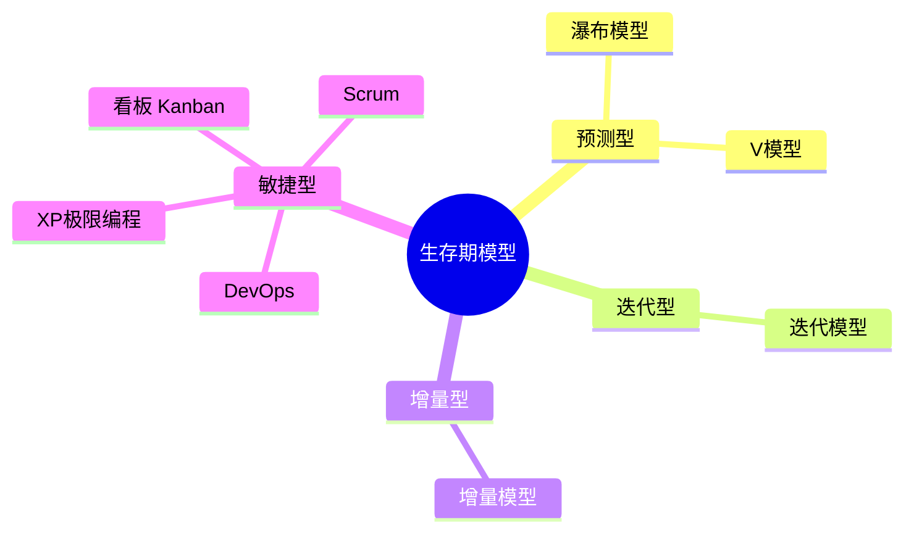

# 📌 软件项目管理·重点知识图谱

> 🎨 **可视化版已上线！** 欢迎打开 [[软件项目管理·知识图谱.canvas]] 查看交互式知识图谱（在 Obsidian 中可直接拖拽缩放）
>
> 本笔记整合了所有作业与课堂检测的高频考点，按主题分类，配合[[软件项目管理·复习索引]]使用效果更佳。

---

## 🔰 一、项目与项目管理基础

### 项目的特征
- **临时性** — 有明确的开始和结束
- **独特性** — 创造唯一的产品/服务
- **渐进明细** — 逐步细化完善
- ❌ **重复性** 不是项目特征（那是日常运作）

### 软件项目的特殊性
| 特殊性 | 说明 |
|--------|------|
| ⚡ **变更频繁** | 需求易变，导致范围蔓延 |
| 🔄 **渐进明细** | 需求逐步明确 |
| 💿 **逻辑实体** | 非物理实体，不可见 |
| 🔗 **相互作用的系统** | 依赖复杂 |

### 项目管理的核心目的
> [!quote] 确保项目达到期望的结果

### 核心概念辨析
- **项目组合**：为实现战略目标而组合的项目/项目集/其他工作
- **项目集**：相互关联且被协调管理的项目
- **项目**：临时性、独特性的努力

**相关文件：** [[课堂检测(1)]] Q4-Q5、[[课堂检测(2)]] Q18/Q32、[[课堂检测(3)]] Q7/Q13/Q34

---

## 🔰 二、生存期模型

### 分类总览

### 各模型对比

| 模型 | 核心特点 | 适用场景 |
|------|---------|---------|
| **瀑布** | 线性顺序、阶段分明、文档驱动 | 需求明确、技术成熟、短期项目 |
| **V模型** | 测试与开发一一对应 | 需求明确，对性能/安全要求严格（如航天、财务系统） |
| **增量模型** | 分阶段交付可使用的增量 | 需求大部分明确但可能变化 |
| **迭代模型** | 逐步完善需求，每次迭代含完整流程 | 需求不明确，需快速验证 |
| **敏捷（Scrum等）** | 迭代增量、响应变化、客户协作 | 需求频繁变化、需快速交付 |
| **DevOps** | 开发运维一体化 | 持续交付、自动化运维 |

> [!tip] 高频易错
> - 瀑布模型 **适合** 短期项目（❌ 不是不适合）
> - V模型适合对安全&性能要求严格的项目
> - 敏捷模型兼具迭代和增量的特点
> - 敏捷模型 ≠ 预测型和迭代型的混合（❌）

### 敏捷宣言四大价值观
1. **个体和互动** > 流程和工具
2. **工作的软件** > 详尽的文档
3. **客户合作** > 合同谈判
4. **响应变化** > 遵循计划 ❗

### Scrum三核心角色
> **产品负责人（PO）** → **Scrum Master** → **开发团队**

### 重要概念
- **Epic**：高层次需求 → **Story**（用户故事）→ **Task**（具体任务）
- **Product Backlog**：产品待办事项列表
- **Sprint Backlog**：冲刺待办列表（细化后可完成的Story）
- **燃尽图**：跟踪冲刺进度
- **用户故事接收标准**：写在 **故事卡背面**
- **看板核心**：限制在制品数量（WIP）
- **XP核心实践**：结对编程、TDD、持续集成（❌ 冲刺计划不是XP的）

**相关文件：** [[课堂检测(1)]] Q7-Q11/Q19-Q20、[[课堂检测(2)]] Q2/Q5-Q6/Q12/Q16/Q24、[[课堂检测(3)]] Q5/Q15/Q24-Q25、[[作业20260319第三章书后习题]]、[[作业20260402第四和五章书后习题]]

---

## 🔰 三、需求管理

### 需求管理五大过程
> **需求获取 → 需求分析 → 需求规格编写 → 需求验证 → 需求变更管理**

### 需求验证的问题
> 正确性、一致性、完整性、**可行性**、**必要性**、**可检验性**、可跟踪性

❌ 不包括：可盈利性

### 需求变更控制流程
1. **变更申请**（需求方发起）
2. **变更评估**（分析影响）
3. **变更审批**（CCB批准或项目经理自行决定）
4. **变更实施**
5. **变更验证**

> [!warning] 不是所有变更都需CCB评估，部分可由项目经理决定

### 需求建模方法
| 传统方法 | 敏捷方法 |
|---------|---------|
| 原型方法 | 用户故事（Story） |
| 基于数据流建模（DFD） | Product Backlog |
| 基于UML建模 | Sprint Backlog |
| DFD元素：过程、实体、数据流、数据存储 | |

❌ DFD不含：**用例**、**类**

### UML需求视图四件套
> **用例图** + **顺序图** + **状态图** + **活动图**

- **用例图** → 描述系统与外部参与者的交互

### INVEST原则
> Story的检验标准：**I**ndependent（独立）、**N**egotiable（可协商）、**V**aluable（有价值）、**E**stimable（可估计）、**S**mall（足够小）、**T**estable（可测试）

**相关文件：** [[课堂检测(1)]] Q12/Q16/Q27-Q28/Q30、[[课堂检测(2)]] Q11/Q13/Q28、[[课堂检测(3)]] Q1/Q8/Q12/Q27、[[作业20260402第四和五章书后习题]]

---

## 🔰 四、任务分解与 WBS

### WBS 核心
> **WBS** (Work Breakdown Structure) = 任务分解结构，对项目由粗到细的分解过程，**面向交付成果**

### WBS 表达形式
- ✅ 图表式 / 清单式 / 树形结构
- ❌ 矩阵式

### 分解方法
| 方法 | 方向 | 适用场景 |
|------|------|---------|
| **自顶向下** | 整体→局部 | 熟悉项目、有大局把握 |
| **自底向上** | 局部→整体 | 新项目、不熟悉 |
| 类比法 | 参考类似项目 | 有历史数据 |
| 模板参照法 | 使用标准化模板 | 通用场景 |

### WBS 要点
- **最低层次** = 工作包（Work Package）
- 工作包应由 **唯一主体负责**
- 提供 **项目范围基线**
- ❌ 分解层次不少于3层 → 不是必须标准
- ❌ 最底层是能分配到一个人完成的任务 → 太细了

**相关文件：** [[课堂检测(1)]] Q13/Q23/Q29、[[课堂检测(2)]] Q14/Q19/Q31/Q34、[[课堂检测(3)]] Q2/Q14/Q16/Q19/Q29、[[作业20260402第四和五章书后习题]]

---

## 🔰 五、成本估算

### 规模→工作量→成本 三级流程
> **规模估算**（功能点数量）→ **工作量估算**（人月/人天）→ **成本估算**

### 估算方法

| 方法 | 类型 | 说明 |
|------|------|------|
| **类比估算法** | 自上而下 | 参考历史类似项目，适用信息不足时 |
| **自下而上估算法** | 自下而上 | 分解到最细粒度再汇总 |
| **参数估算法** | 参数化 | 基于模型参数 |
| **三点估算法** | PERT | O+M+P |
| **专家估算法** | 经验 | 专家判断 |
| **功能点估算（FP）** | 规模 | 与技术无关 |
| **用例点估算（UCP）** | 规模 | 分析用例角色 |
| **故事点估算** | 敏捷 | 敏捷团队使用 |

### IFPUG 功能点估算
> **FP = UFC × TCF**

- **UFC**（未调整功能点计数）= EI + EO + EQ + ILF + EIF
- **TCF**（技术复杂度因子）= 14个技术因素调整

5类功能项：
1. 外部输入（EI）
2. 外部输出（EO）
3. 外部查询（EQ）
4. 内部逻辑文件（ILF）
5. 外部接口文件（EIF）

### 定额估算法
> **T = Q / (R × S)**

T=活动历时，Q=工作量，R=人力数量，S=工作效率

### PERT（计划评审技术）
> **期望值 E = (O + 4M + P) / 6**
> **标准差 δ = (P - O) / 6**

### 单位换算
> **1人月 = 22人天 = 176有效工时**

> [!tip] 功能点 vs 代码行
> - 功能点（FP）与编程语言和技术 **无关**
> - 代码行（LOC）与编程语言 **有关**

**相关文件：** [[课堂检测(1)]] Q1/Q6/Q9/Q15/Q18/Q21/Q26、[[课堂检测(2)]] Q1/Q4/Q9/Q25-Q26/Q30、[[课堂检测(3)]] Q9/Q11/Q17/Q28/Q33、[[作业20260416第六章书后习题]]

---

## 🔰 六、进度管理

### 网络图

| 类型 | 节点含义 | 箭线含义 |
|------|---------|---------|
| **ADM**（双代号） | 代号/事件 | **活动（任务）** |
| **PDM**（单代号） | **活动（任务）** | 逻辑关系 |

### 虚活动
> ❌ 不消耗资源，❌ 不占用时间 → 仅表示逻辑关系

### 进度管理图示
- **甘特图** — 条形图，显示活动起止时间 ❌ 不能显示关键路径
- **网络图** — 显示活动依赖关系
- **里程碑图** — 显示关键节点
- **燃尽图** — 显示剩余工作量变化

### 关键路径 & 时间压缩
> **关键路径** = 决定项目最短完成时间的路径

**时间压缩法：**
- **赶工** — 增加资源
- **快速跟进** — 并行执行

### 自制 vs 购买决策
> **成本平衡点** = (自制初始 - 购买初始) / (购买月维护 - 自制月维护)

**相关文件：** [[课堂检测(1)]] Q3/Q32/Q35、[[课堂检测(2)]] Q7/Q15/Q17/Q29、[[课堂检测(3)]] Q3/Q6/Q23/Q30、[[作业20260514第七章书后习题]]

---

## 🔰 七、质量管理

### 质量成本
> **质量成本 = 预防成本 + 缺陷成本**

### 核心概念
- **软件质量**：软件满足明确或隐含需求的程度
- **质量管理两大过程**：质量保证 + 质量控制
- **质量保证主要活动**：产品审计 + 过程审计
- **敏捷质量外延**：测试左移 + 测试右移

**相关文件：** [[作业20260609第八章和第九章书后习题]]

---

## 🔰 八、风险管理

### 风险三要素
> **风险事件** × **事件发生概率** × **事件影响**

### 风险评估
- **定性风险分析** — 主观评估
- **定量风险分析** — 数据驱动：
  - 盈亏平衡分析
  - 模拟（蒙特卡洛）
  - 访谈
  - 决策树分析
  - 敏感性分析

### 风险应对策略
- **回避** — 主动放弃/拒绝高风险方案
- 转移、缓解、接受等

### 采购管理
> 从项目团队外获取产品/服务/结果的过程

**相关文件：** [[作业20260618第十一章和第十二章书后习题]]

---

## 🔰 九、团队与沟通

### 组织结构
| 类型 | 特点 |
|------|------|
| **职能型** | 发挥职能部门资源集中优势 |
| **项目型** | 以项目为中心 |
| **矩阵型** | 职能+项目混合 |

### 沟通
- **沟通渠道数** = n×(n-1)/2（n=人数）
- 例：20人 → 190条渠道
- 复杂问题多用 **口头沟通**

### 敏捷团队
> 强调 **自组织** 形式团队

**相关文件：** [[作业20260611第十章书后习题]]

---

## 🔰 十、AI赋能项目管理

> AI可应用于：计划、估算、跟踪、控制
> 案例：Co-Project 将两周估算缩短到两小时

**相关文件：** [[课堂检测(2)]] Q23、[[课堂检测(3)]] Q5

---

## 💡 常用公式速查

| 公式 | 说明 |
|------|------|
| FP = UFC × TCF | 功能点估算 |
| T = Q / (R × S) | 定额估算法（活动历时） |
| E = (O + 4M + P) / 6 | PERT期望值 |
| δ = (P - O) / 6 | PERT标准差 |
| 1人月 = 22人天 = 176工时 | 单位换算 |
| 渠道 = n(n-1)/2 | 沟通渠道数 |
| (自制-购买初始) / (购买-自制月维护) | 成本平衡点 |

---

> 📖 配合 [[软件项目管理·复习索引]] 按章节查找对应题目
